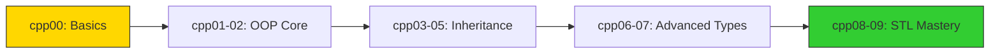
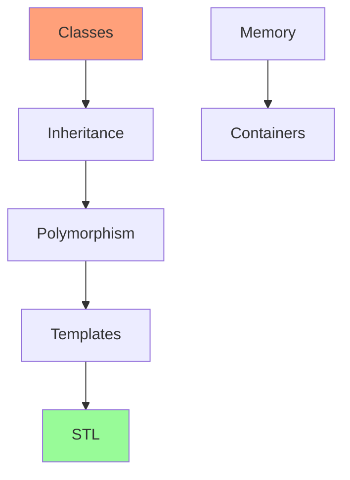
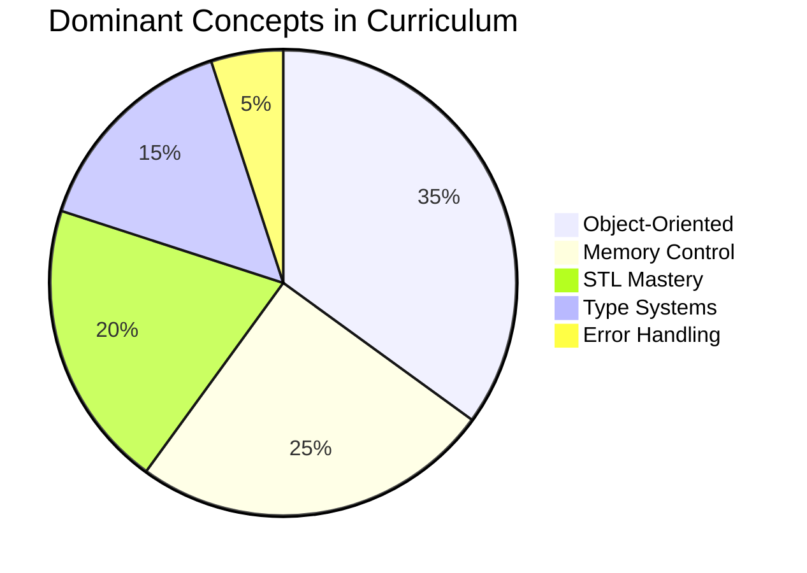

<h1 align="center">
  
</h1>

  <b><i>42 C++ Piscine Journey</i></b> 
  <i>"From memory management to template metaprogramming"</i>

  
  
  

  
  

---

## 🌟 C++ Learning Journey

### Module Progression Map

## 📚 Comprehensive Module Guide

| Module | Focus Area | Key Concepts | Key Achievements | Paradigm Focus | Memory Concepts | STL Components |
|--------|------------|--------------|------------------|----------------|-----------------|----------------|
| **cpp00** | Syntax Fundamentals | `Classes`, `iostream`, `namespaces` | Class creation, I/O operations | Procedural → OOP | Stack allocation | `std::cin/cout` |
| **cpp01** | Memory Systems | `References`, `pointers`, `RAII` | Reference vs pointer mastery | Memory management | Heap vs stack | `std::string` |
| **cpp02** | Canonical Form | `Canonical form`, `operator overloading` | Fixed-point arithmetic | Object-oriented | Fixed-point memory | - |
| **cpp03** | Inheritance | `Inheritance`, `diamond problem` | Class hierarchy design | OOP hierarchies | Constructor chaining | - |
| **cpp04** | Polymorphism | `Virtual functions`, `abstract classes` | Virtual function systems | Polymorphism | vtable/runtime | - |
| **cpp05** | Error Handling | `Exception handling`, `nested classes` | Exception hierarchies | Error management | Resource cleanup | - |
| **cpp06** | Type Safety | `C++ casts`, `type identification` | Advanced casting techniques | Type systems | Dynamic casting | `typeid()` |
| **cpp07** | Generics | `Templates`, `generic programming` | Template programming | Meta-programming | Template instantiation | `std::vector` |
| **cpp08** | STL Containers | `Container adapters`, `iterators` | Custom iterator creation | Generic programming | Allocator patterns | Full STL |
| **cpp09** | Data Systems | `STL algorithms`, `design patterns` | Complex STL applications | Systems programming | Cache efficiency | Advanced STL |

## 🧩 Concept Dependencies

---

## 🏆 Final Notes

All projects follow the **42 C++ Coding Standards**:
- Orthodox Canonical Form for all classes
- No memory leaks (verified with Valgrind)
- -Wall -Wextra -Werror compilation
- Clean, modular code structure
- Comprehensive test cases

**Progression:**  
The sequence carefully builds from basic OOP concepts to advanced template metaprogramming, mirroring professional C++ skill development.

## 🎯 Module Focus Highlights

### Foundational Modules
- **cpp00-cpp02**: Core language mechanics
- **cpp03-cpp05**: Object-oriented mastery
- **cpp06-cpp07**: Type system & generics

### Advanced Modules
- **cpp08**: STL architecture
- **cpp09**: Production-grade patterns

## 📊 Concept Weight Analysis

## 🏁 Learning Progression

1. **Syntax Fundamentals** (00-01)
2. **OOP Implementation** (02-04)
3. **Robustness Systems** (05-06) 
4. **Generic Patterns** (07-08)
5. **Architecture Design** (09)

