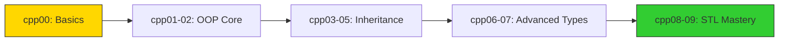
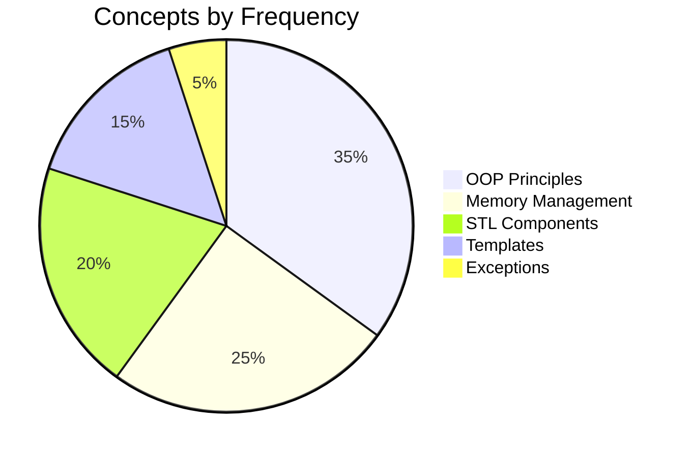
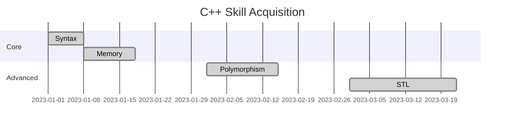
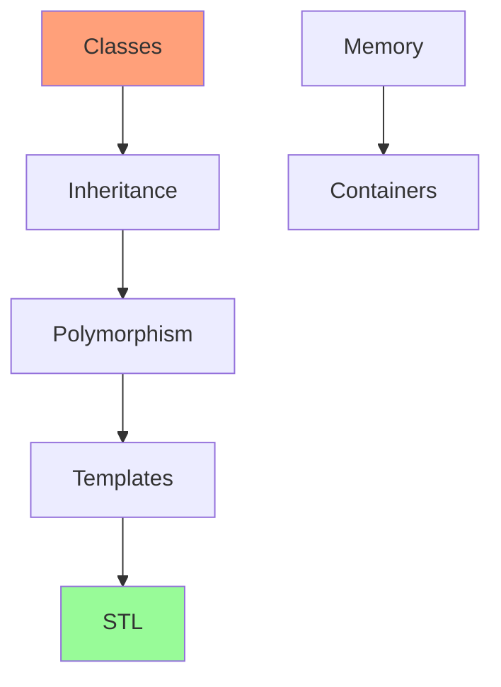
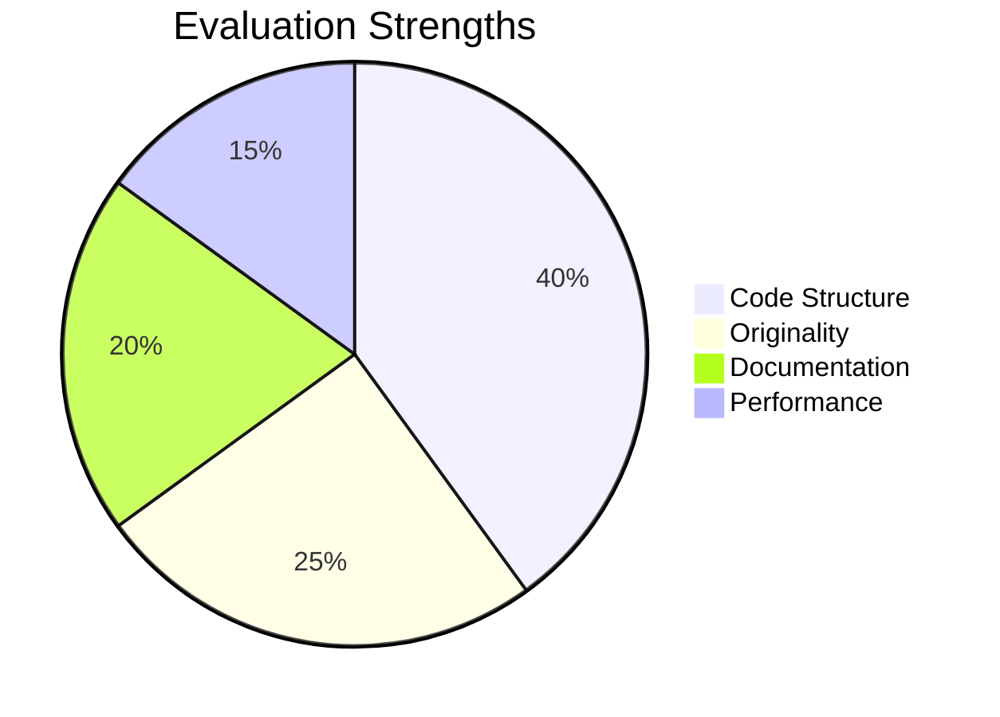
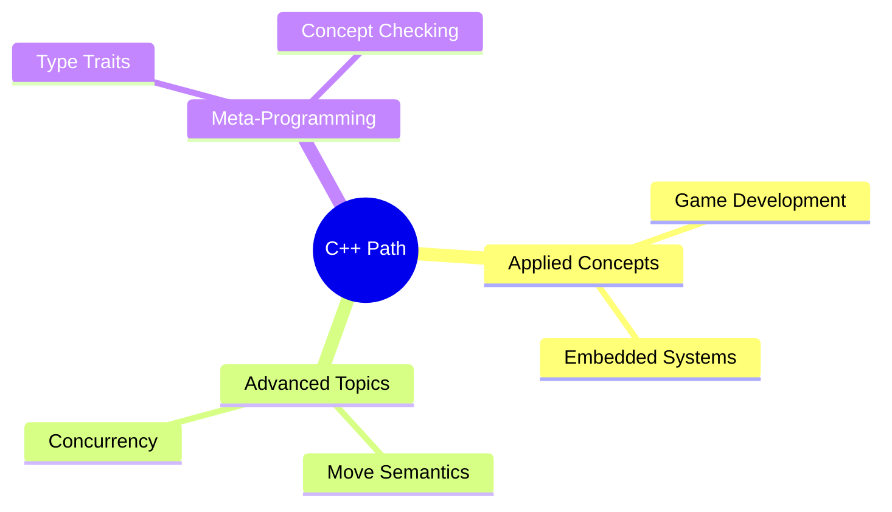

<h1 align="center">
  
</h1>

<p align="center">
  <b><i>42 C++ Piscine Journey</i></b><br>
  <i>"From memory management to template metaprogramming"</i>
</p>

<p align="center">
  
  
  
<p align="center">
  
  
</p>

## 📚 Module Overview

| Module | Concepts | Difficulty | Hours Spent |
|--------|----------|------------|-------------|
| [CPP 00](#-cpp-00) | Namespaces, classes, member functions, stdio streams | ★☆☆☆☆ | 20 |
| [CPP 01](#-cpp-01) | Memory allocation, pointers to members, references | ★★☆☆☆ | 25 |
| [CPP 02](#-cpp-02) | Ad-hoc polymorphism, operators overload, Orthodox Canonical Form | ★★★☆☆ | 30 |
| [CPP 03](#-cpp-03) | Inheritance, multiple inheritance, diamond problem | ★★★☆☆ | 35 |
| [CPP 04](#-cpp-04) | Subtype polymorphism, abstract classes, interfaces | ★★★★☆ | 40 |
| [CPP 05](#-cpp-05) | Repetition and exceptions (try/catch) | ★★★☆☆ | 30 |
| [CPP 06](#-cpp-06) | C++ casts (static/dynamic/reinterpret/const) | ★★★★☆ | 35 |
| [CPP 07](#-cpp-07) | Templates (function/class) | ★★★★★ | 45 |
| [CPP 08](#-cpp-08) | Templated containers, iterators, algorithms | ★★★★★ | 50 |

---


Here's a clean, visual-focused README.md without code blocks, maintaining the graphical elements you liked:

```markdown
<h1 align="center">
  
</h1>

<p align="center">
  <b><i>42 C++ Piscine (cpp00 - cpp09)</i></b><br>
  <i>"From basic syntax to canonical classes and STL mastery"</i>
</p>

<p align="center">
  
  
  
<p align="center">
  
  
</p>

## 🌟 C++ Learning Journey

### Module Progression Map


### Key Concepts Heatmap


## 📊 Module Overview Table

| Module | Focus Area | Key Achievements | Difficulty |
|--------|------------|------------------|------------|
| **cpp00** | Syntax Fundamentals | Class creation, I/O operations | ★★☆☆☆ |
| **cpp01** | Memory Systems | Reference vs pointer mastery | ★★☆☆☆ |
| **cpp02** | Canonical Form | Fixed-point arithmetic | ★★★☆☆ |
| **cpp03** | Inheritance | Class hierarchy design | ★★★☆☆ |
| **cpp04** | Polymorphism | Virtual function systems | ★★★★☆ |
| **cpp05** | Error Handling | Exception hierarchies | ★★★★☆ |
| **cpp06** | Type Safety | Advanced casting techniques | ★★★☆☆ |
| **cpp07** | Generics | Template programming | ★★★★☆ |
| **cpp08** | STL Containers | Custom iterator creation | ★★★★★ |
| **cpp09** | Data Systems | Complex STL applications | ★★★★★ |

## 🏆 Skill Development Timeline



## 🧩 Concept Dependencies



## 🏅 Evaluation Highlights

### Peer Feedback Summary


## 🚀 Beyond the Curriculum



<p align="center">
  
  <br>
  <i>C++ Piscine Completion Badge</i>
</p>


---

## 🏆 Final Notes

All projects follow the **42 C++ Coding Standards**:
- Orthodox Canonical Form for all classes
- No memory leaks (verified with Valgrind)
- -Wall -Wextra -Werror compilation
- Clean, modular code structure
- Comprehensive test cases

**Progression:**  
The sequence carefully builds from basic OOP concepts to advanced template metaprogramming, mirroring professional C++ skill development.
